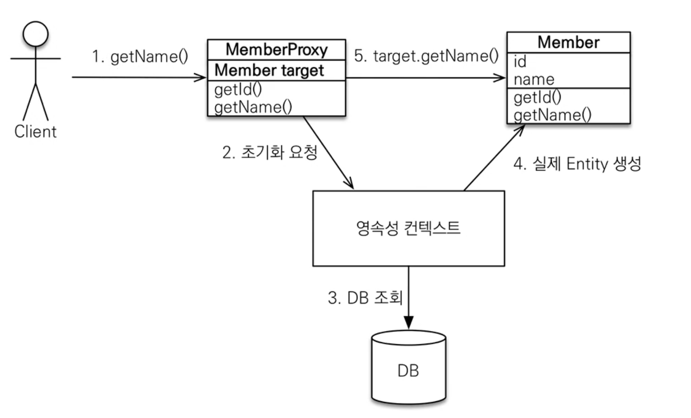
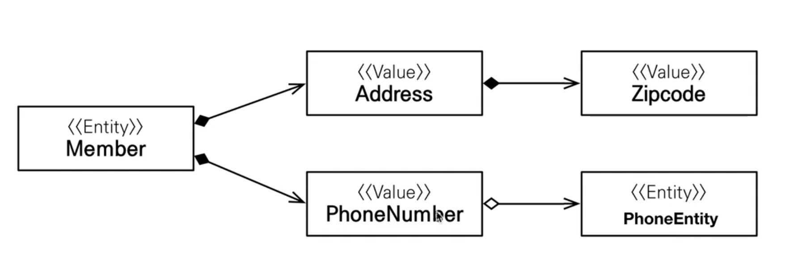

# JPA란

## 1. SQL 중심적인 개발의 문제점

현대적인 애플리케이션을 개발할때는 대부분 객체지향 언어를 사용

DB는 관계형 DB를 씀. - Oracle이나, MySql을 씀.

코드를 막상 열어보면 SQL 중심적으로 구현이 되어있음.


### 객체와 관계형 데이터베이스의 차이

- 상속
  - 객체는 있으나 관계형 DB는 없음
- 연관관계
  - 객체는 참조를 통해서 얻음
  - DB는 Join을 통해 찾을 수 있음
- 데이터 타입
- 데이터 식별 방법


객체는 자유롭게 객체 그래프를 탐색할 수 있어야한다.


## 2. JPA 소개

Java Persistance API

자바 표준 ORM

### ORM

- Object-relational-mapping(객체 관계 매핑)
- 객체는 객체대로 설계
- 관계형 데이터베이스는 관계형 데이터베이스대로 설계


### JPA를 왜 사용해야 하는가?

- SQL 중심적인 개발에서 객체 중심으로 개발
- 생산성
- 유지보수
- 패러타임의 불일치 해결
- 성능
- 데이터 접근 추상화와 벤더 독립성
- 표준


### 생산성 - JPA와 CRUD

- 저장: jpa.persist(member)
- 조회: jpa.find(memberId)
- 수정: member.setName("변경할 이름")
- 삭제 jpa.remove(member)


### 유지보수

- 기존: 필드 변경시 모든 SQL 수정
- JPA 사용: 필드만 추가하면 됨. SQL은 JPA가 처리


#### JPA는 동일한 트랜잭션에서 조회한 엔티티는 같음을 보장


### 성능

- 1차 캐시와 동일성 보장

- 트랜잭션을 지원하는 쓰기 지연

  - buffering 기능 구현

    - 트랜잭션을 커밋할때 까지 Insert SQL을 모음

    - JDBC BATCH SQL 기능을 사용해서 한번에 SQL 전송

    - Ex)

      em.persist(memberA);

      em.persist(memberB);

      em.persist(memberC);

      //여기 까지 Insert SQL을 데이터베이스에 보내지 않는다.


      //커밋 하는 순간 데이터베이스에 Insert Sql을 모아서 보낸다.
    
      transactio.comit();//트랜잭션 커밋

- 지연 로딩

  - 지연 로딩: 객체가 실제 사용될 때 로딩
  - 즉시 로딩: Join Sqlfh 한번에 연관된 객체까지 미리 조회

### 트랜잭션
JPA에서는 모든 데이터를 변경하는 작업은 꼭 트랜잭션 안에서 실행되어야 한다.

### entityManger
자바의 콜렉션이라고 생각하면 됨, 내 객체를 대신 저장해주는 것이라 생각하면 된다.

JPA를 통해서 Entity를 가져오면 JPA가 관리를 함. JPA가 트랜잭션 커밋시점에 데이터 변경 유무를 체크하고, 데이터가 바뀌면 Update 쿼리를 직접만들어서 전송함.

EntityManagerFactory는 서버가 실행할 때 하나만 생성해서 애플리케이션 전체에서 공유한다.
(내 생각에는 Spring Bean을 관리하는 것 같이 싱글 톤으로 관리하는 것 같다.)

EntityManager는 고객의 요청이 올때마다 일회용처럼 사용했다가 버린다.
**그러므로 entitymanager는 쓰레드간에 공유하면 절대 안된다.**

**JPA의 모든 데이터 변경은 트랜잭션 안에서 실행 되어야 한다.**

### JPQL
JPA는 SQL을 추상화한 JPQL이라는 객체 지향 쿼리 언어를 제공한다.
테이블이 아닌 엔티티 객체를 대상으로 쿼리를 함.

JPA를 사용하면 엔티티 객체를 중심으로 개발

문제는 검색 쿼리

검새을 할때에도, 테이블이 아닌 엔티티 객체를 대상으로 검색

애플리케이션이 필요한 데이터만 DB에서 불러오려면 결국 검색 조건이 포함된 SQL이 필요함.

### 영속성 컨텍스트

- JPA를 이해하는데 가장 중요한 용어

- "엔티티(Table)를 영구 저장하는 환경"이라는 뜻

- EntityManager.persist(entity); - 영속성 컨텍스트에 entity를 영속화 한다.

- 영속성 컨텍스트는 논리적인 개념이다. 엔티티 매니저를 통해서 영속성 컨텍스트에 접근한다.

  - EntityManager -> PersistenceContext(영속성 컨텍스트)

- 엔티티의 생명 주기

  - 비영속 - 영속성 컨텍스트와 전혀 관계가 없는 **새로운** 상태
  - 영속 - 영속성 컨텍스트에 **관리**되는 상태
  - 중영속 - 영속성 컨텍스트에 저장되었다가 **분리** 상태
  - 삭제 - **삭제**된 상태

- 영속성 컨텍스트의 이점

  - 1차 캐시

  - 동일성 보장

  - 트랜잭션을 지원하는 쓰기 지연

    - Persist 시 JPA가 insert SQL을 생성하여 쓰기지연 SQL 저장소와 1차 캐시에 저장한다.

    - 코드상에, 트랜잭션을 커밋하는 시점(tx.commit)에 쓰기지연 저장소에 있는 쿼리들이 flush 되면서 실제 DB에 트랜잭션에 커밋된다.

      ~~~java
      Member member1 = new Member(150L, "A");
      Member member2 = new Member(160L, "B");
      
      //영속
      em.persist(member1);
      em.persist(member2);
      
      //Flush 되는 시점
      tx.commit(); //트랜잭션 커밋
      ~~~

    - jdbc 배치를 통해 쿼리를 한번에 전송할 수 있다.

    - ```xml
      value만큼 모아서 한번에 전송한다.
      <property name="hibernate.jdbc.batch_size" value="10"/>
      ```

  - 변경 감지(Dirty Checking)

    - persist를 하지 않아도, JAVA Collection 처럼 값을 바꾸면 알아서 DB에 적용된다.

    - ```java
      try {
          Member member = em.find(Member.class, 150L);
          member.setName("ZZZZ");
      
          System.out.println("===============");
      
          tx.commit(); //트랜잭션 커밋
      }
      
      Hibernate: 
          select
              member0_.id as id1_0_0_,
              member0_.name as name2_0_0_ 
          from
              Member member0_ 
          where
              member0_.id=?
      ===============
      Hibernate: 
          /* update
              hellojpa.Member */ update
                  Member 
              set
                  name=? 
              where
                  id=?
      ```

    - JPA는 커밋하는 시점에  flush가 호출되면서 entity와 snapshot을 비교한다.

    - | @ID     | Entity       | 스냅샷         |
            | ------- | ------------ | -------------- |
      | memberA | memberA 객체 | memberA 스냅샷 |
      | memberB | memberB 객체 | memberB 스냅샷 |

      비교를 한뒤, Update SQL를 쓰기지연 SQL 저장소에 저장한다.

  - 지연 로딩

### 플러시

- 플러시는 영속성 컨텍스트의 변경내용을 데이터베이스에 반영한다.
  - 영속성 컨텍스트의 변경사항과 실제 DB를 맞추는 거라고 생각하면 됨.

#### 플러시가 발생할 때

- 변경 감지
- 수정된 엔티티 쓰기 지연 SQL 저장소에 등록
- 쓰기 지연 SQL 저장소의 쿼리를 데이터 베이스에 전송 (등록, 수정, 삭제 쿼리)

#### 영속성 컨텍스트를 플러시 하는 방법

- em.flush() - 직접 호출
- 트랜잭션 커밋 - 플러시 자동 호출
- JPQL 쿼리 실행 - 플러시 자동 호출

#### 플러시 모드 옵션

- FlushModeType.AUTO
  - 커밋이나 쿼리를 실행할 때 플러시 (기본값)
- FlushModeType.COMMIT
  - 커밋할 때만 플러시

#### 플러시의 유의사항

- 영속성 컨텍스트를 비우지 않는다.
- 영속성 컨텍스트의 변경내용을 데이터베이스에 동기화 한다.
- 트랜잭션이라는 작업 단위 중요 -> 커밋 직전에만 동기화 하면 된다.
  - **실무에서 영속성 컨텍스트랑 트랜잭션의 주기랑 맞추게 개발을 해야 한다.**

### 준영속 상태

- 영속(em.persist, em.find) - > 준영속
- 준영속 상태란 영속 상태의 엔티티가 영속성 컨텍스트에서 분리(detached)
- 영속성 컨텍스트가 제공하는 기능을 사용 못함

#### 준영속 상태로 만드는 방법

- em.detach(entity)
  - 특정 엔티티만 준영속 상태로 전환
- em.clear()
  - 영속성 컨텍스트를 완전히 초기화
- em.close()
  - 영속성 컨텍스트를 종료

### 엔티티 매핑

- 객체와 테이블 매핑: @Entity, @Table

- 필드와 컬럼 매핑: @Column

- 기본 키 매핑: @Id

- 연관관계 매핑: @ManyToOne, @JoinColumn


### 객체와 테이블 매핑

#### @Entity

- @Entity가 붙은 클래스는 JPA가 관리하는 엔티티라 한다.

- JPA를 사용해서 테이블과 매핑할 클래스는 **@Entity** 필수이다.
- 주의
  - 기본 생성자 필수(파라미터가 없는 pulic 또는 protected 생성자)
  - final 클래스, enum, interface, inner 클래스 사용X
  - 저장할 필드에 final 사용X
- 속성 정리
  - name
    - JPA에서 사용할 엔티티 이름을 지정한다.
    - 기본값: 클래스 이름을 그대로 사용(예: Member)
    - 같은 클래스 이름이 없으면 가급적 기본값을 사용한다.

#### @Table

- @Table은 엔티티와 매핑할 테이블 지정

  | 속성                   | 기능                                | 기본값             |
    | ---------------------- | ----------------------------------- | ------------------ |
  | name                   | 매핑할 테이블 이름                  | 엔티티 이름을 사용 |
  | catalog                | 데이터베이스 catalog 매핑           |                    |
  | schema                 | 데이터베이스 schema 매핑            |                    |
  | uniqueConstraints(DDL) | DDL 생성 시에 유니크 제약 조건 생성 |                    |


### 데이터베이스 스키마 자동 생성

- DDL(데이터 조작어)를 애플리케이션 실행 시점에 자동 생성
- 테이블 중심 -> 객체 중심
- 데이터베이스 방언을 활용해서 데이터베이스에 맞는 적절한 DDL 생성
  - Oracle은 varchar를 생성할때 varchar2로 생성함
  - H2는 varchar로 생성함
- 이렇게 생성된 DDL은 개발 장비에서만 사용
- 생성된 DDL은 운영서버에서는 사용하지 않거나, 적절히 다듬은 후 사용

#### 속성

| 옵션          | 설명                                        |
| ------------- | ------------------------------------------- |
| create        | 기존테이블 삭제 후 다시 생성(DROP + CREATE) |
| create - drop | create와 같으나 종료시점에 테이블 DROP      |
| update        | 변경분만 반영(운영DB에는 사용하면 안됨)     |
| validate      | 엔티티와 테이블이 정상 매핑되었는지만 확인  |
| none          | 사용하지 않음                               |

#### 주의 사항

- 운영 장비에는 절대 create, create-drop, update를 사용하면 안된다.
- 개발 초기 단계는 create 또는 update 을 권장한다.
- 테스트 서버는 update 또는 validate 을 권장한다.
- 스테이징과 운영서버는 validate 또는 none 을 권장한다.

#### DDL 생성기능

- 제약조건 추가: 회원 이름은 **필수**, 10자 초과X
  - @Column(nullable = false, length = 10)
- 유니크 제약조건 추가
  - @Table(uniqueConstraints = {@UniqueConstraint(name = "NAME_AGE_UNIQUE", columnNames = {"NAME", "AGE"})})

- DDL 생성 기능은 DDL을 자동 생성할 때만 사용되고, JPA의 실행 로직에는 영향을 주지 않는다.


### 필드와 컬럼 매핑

#### 매핑 어노테이션 정리

| 어노테이션  | 설명                                  |
| ----------- | ------------------------------------- |
| @Column     | 컬럼 매핑                             |
| @Temporal   | 날짜 타입 매핑                        |
| @Enumerated | enum 타입 매핑                        |
| @Lob        | BLOB, CLOB 매핑                       |
| @Transient  | 특정 필드를 컬럼에 포함시키지 않을 때 |

#### @Column

| 속성                   | 설명                                                         | 기본값                             |
| ---------------------- | ------------------------------------------------------------ | ---------------------------------- |
| name                   | 필드와 매핑할 테이블의 컬럼 이름                             | 객체의 필드 이름                   |
| insertable, updateable | 등록, 변경 가능 여부                                         | TRUE                               |
| nullable(DDL)          | null값의 허용 여부를 설정한다. false로 설정하면 DDL 생성 시에 not null 제약조건이 붙는다. |                                    |
| unique(DDL)            | @Table의 uniqueConstraints와 같지만 한 컬럼에 간단히 유니크 제약조건을 걸 때 사용한다. |                                    |
| columnDefinition       | 데이터베이스 컬럼 정보를 직접 줄 수 있다.<br/>ex)varchar(100) default 'EMPTY' | 필드의 자바 타입과 방언정보를 사용 |
| length(DDL)            | 문자 길이 제약조건, String 타입에만 사용한다.                | 255                                |
| precsion               | BigDecimal타입에서 사용한다.(BigInteger도 사용할 수 있다.) precision은 소수점을 포함한 전체 자릿 수를 scale은 소수의 자릿수이다. 참고로 double, float 타입에는 적용되지 않는다. 아주 큰 숫자나 정밀한 소수를 다루어야 할때만 사용한다. | precision=19,scale=2               |

#### @Enumerated

- 자바 enum 타입을 매핑할 때 사용
- **주의! ORDINAL 사용X**
  - **Ordinal 사용시 숫자(0 ~ n)로 값이 들어가기 때문에 enum에 값이 추가되면 꼬일 수 있다.**

| 속성  | 설명                                                         | 기본값           |
| ----- | ------------------------------------------------------------ | ---------------- |
| value | - EnumType.ORINAL: enum 순서를 데이터베이스에 저장<br/>- EnumType.STRING: enum 이름을 데이터 베이스에 저장 | EnumType.ORDINAL |

#### @Temporal

- 날짜 타입을 매핑할 때 사용
- 참고: LocalDate, LocalDateTime을 사용할 때는 생략 가능(최신 하이버네이트 지원)

| 속성  | 설명                                                         | 기본값 |
| ----- | ------------------------------------------------------------ | ------ |
| value | - TemporalType.DATE: 날짜, 데이터베이스 date 타입과 매핑<br/>ex) 2013-10-11<br/>- TemporalType.TIME: 시간 데이터베이스 time 타입과 매핑<br/>ex) 11:11:11<br/>- TemporalType.TIMESTAMP: 날짜와 시간, 데이터베이스 timestamp 타입과 매핑(예: 2013-10-11 11:11:11) |        |

### @Lob

데이터베이스 BLOB, CLOB 타입과 매핑

- @Lob에는 지정할 수 있는 속성이 없다.
- 매핑하는 필드 타입이 문자면 CLOB 매핑, 나머지는 BLOB 매핑
  - CLOB: String, char[], java.sql.CLOB
  - BLOB: byte[], java.sql.BLOB

#### @Transient

- 필드 매핑X

- 데이터베이스에 저장X, 조회X

- 테이블에 컬럼으로 추가를 안하고, 주로 메모리상에서만 임시로 어떤 값을 보관하고 싶을 때 사용

- @Transient

  private Integer temp

### 기본키 매핑

#### 기본키 매핑 어노테이션

- @Id
- @GeneratedValue

#### 기본키 매핑 방법

- 직접 할당: @Id만 사용
- 자동 생성: (@GeneratedValue)
  - IDENTITY: 데이터베이스에 위임, MYSQL
  - SEQUENCE: 데이터베이스 시퀀스 오브젝트 사용, ORACLE, PostgreSQL
    - @SequenceGenerator 필요
  - TABLE: 키 생성용 테이블 사용, 모든 DB에서 사용
    - @TableGenerator 필요
  - AUTO: 방언에 따라 자동 지정, 기본값 설정

#### IDENTITY 전략 - 특징

- 기본 키 생성을 데이터베이스에 위임

- 주로 MySQL, SQL Server, DB2에서 사용

  (예: MySQL의 AUTO_ICREMENT)

- JPA는 보통 트랜잭션 커밋 시점에 INSER SQL 실행
- AUTO_INCREMENT는 데이터베이스 INSERT SQL을 실행한 이후에 ID 값을 알 수 있음
- IDENTITY 전략은 em.persist() 시점에 즉시 INSERT SQL 실행하고 DB에서 식별자를 조회


#### SEQUENCE 전략 - 특징

- 데이터베이스 시퀀스는 유일한 값을 순서대로 생성하는 특별한 데이터베이스 오브젝트(예: 오라클 시퀀스)
- 오라클, PostgreSQL, DB2, H2 데이터베이스에서 사용

#### @SequenceGenrator

- 주의: allocationSize 기본값 = 50

| 속성            | 설명                                                         | 기본값             |
| --------------- | ------------------------------------------------------------ | ------------------ |
| name            | 식별자 생성기 이름                                           | 필수               |
| sequenceName    | 데이터베이스에 등록되어 있는 시퀀스 이름                     | hibernate_sequence |
| initailValue    | DDL생성 시에만 사용됨, 시퀀스DDL을 생성할 때 처음 시작하는 수를 지정한다. | 1                  |
| allocationSize  | 시퀀스 한번 호출에 증가하는 수(성능 최적화에 사용됨, **데이터베이스 시퀀스 값이 하나씩 증가하도록 설정되어 있으면 이값을 반드시 1로 설정해야 한다.**) | **50**             |
| catalog, schema | 데이터베이스 catalog, schema 이름                            |                    |


#### 권장하는 식별자 전략

- 기본 키 제약 조건: null 아님, 유일, 변하면 안된다.
- 미래까지 이 조건을 만족하는 자연키는 찾기 어렵다. 대리키를 사용하는것이 권장 된다.
- 예를 들어 주민등록번호도 기본 키로 적절하지 않다.
- 권장: Long형 + 대체 키 + 키 생성전략 사용

### 데이터 중심 설계의 문제점

- 현재 방식은 객체 설계를 테이블 설계에 맞춘 방식(jpashop - 연관관계 매핑)
- 테이블 외래키를 객체에 그대로 가져옴
- 객체 그래프 탐색이 불가능
- 참조가 없으므로 UML도 잘못됨

### 연관관계 매핑

- 객체와 테이블 연관관계 차이를 이해
- 객체의 참조와 테이블 외래 키를 매핑
- 용어 이해
  - 방향(Direction): 단방향, 양방향
  - 다중성(Multiplicity): 다대일(N:1), 일대다(1:N), 일대일(1:1), 다대다(N:M) 이해
  - 연관관계의 주인(Owner): 객체 양방향 연관관계는 관리 주인이 필요

#### 객체를 테이블에 맞추어 데이터 중심으로 모델링하면, 협력 관계를 만들 수 없다.

- **테이블은 외래 키로 조인을 사용해서** 연관된 테이블을 찾는다.
- **객체는 참조를 사용해서** 연관된 객체를 찾는다.
- 테이블과 객체 사이에는 이런 큰 간격이 있다.

~~~java
연관관계 매핑
// 맴버 입장에서는 맴버가 N이고 팀이 1이기 때문에 해당 어노테이션을 사용한다. Member(N) : Team(1)
	@ManyToOne
  @JoinColumn(name = "TEAM_ID")
  //외래키를 team_id로 지정
  private Team team;

//DB에 100번이 있다 가정
//member에 새로운 team을 할당하면 알아서 update 쿼리가 전송된다.
//dirtyChecking으로 인해 자동으로 team_id가 update 됨
	Team newTeam = em.find(Team.class, 100L);
  findMember.setTeam(newTeam);
~~~

### 양방향 연관관계와 연관관계의 주인

#### 양방향 매핑

객체 <-> 객체

Member(Team team) <-> Team(List members)

상단과 같이 객체를 양방향으로 매핑한다.


#### 연관관계의 주인과 mappedBy

##### 객체와 테이블이 관례를 맺는 차이

- 객체 연관관계 = 2개
  - 회원 -> 팀 연관관계 1개(단방향)
  - 팀 -> 회원 연관관계 1개(단방향)
- 테이블 연관관계 = 1개
  - 회원 <-> 팀의 연관관계 1개 (양방향)


#### 객체의 양방향 관계

- 객체의 **양방향 관계는 사실상 양방향 관계가 아니라 서로 다른 단방향 관계가 2개인 것이다.**

- 객체를 양방향으로 참조하려면 단방향 연관관계를 2개 만들어야 한다.

  ~~~java
  class A{
  	B b;//연관관계 매핑 1개 
  }
  
  class B{
  	A a;//연관관계 매핑 1개
  }
  
  A -> B
  B -> A
  ~~~


#### 테이블의 양방향 연관관계

- 테이블은 외래키 하나로 두 테이블의 연관관계를 관리

- MEMBER.TEAM_ID 외래 키 하나로 양방향 연관관계 가짐

  (양쪽으로 조인할 수 있다.)


### 연관관계의 주인(Owner)

#### 양방향 매핑 규칙

- 객체의 두 관계중 하나를 연관관계의 주인으로 지정
- **연관관계의 주인만이 외래 키를 관리(등록, 수정) - Table 설계상에서도 외래키가 있는 객체**
- **주인이 아닌쪽은 읽기만 가능**
- 주인은 mappedBy 속성 사용X
- 주인이 아니면 mappedBy 속성으로 자신의 주인 지정

#### 주의점

##### 양방향 매핑시 연관관계의 주인에 값을 입력해야한다!

(순수한 객체 관계를 고려하면 항상 양쪽다 값을 입력해야한다.)

- 그렇지 않으면 외래키에 Null이 들어간다.
- 1차 캐싱 될 때, 주인이 아닌 객체에는 주인 객체의 참조가 안들어가기 때문에 같은 구문해서 참조를 할 시 아무값도 안나오게 된다.

##### 연관관계 편의 메소드를 생성하자

~~~java
@Entity
Member{
  @ManyToOne
  Team team

  //연관관계 편의 메소드
  public void changeTeam(Team team){
    this.team = team;
    team.getMembers().add(this);
  }
}
~~~

##### 양방향 매핑시에 무한 루프를 조심하자

- 예: toString(), lombok, JSON 생성 라이브러리
  - **실무에서는 왠만하면 Entity를 반환하지말고, Dto에 담아서 반환하자**

#### 양방향 매핑정리

- **단방향 매핑만으로도 이미 연관관계 매핑은 완료**

- 양방향 매핑은 반대 방향으로 조회(객체 그래프 탐색) 기능이 추가된 것 뿐

- JPQL에서 역방향으로 탐색할 일이 많음

- 단방향 매핑을 잘 해놓으면 양방향은 필요할 때 추가해도 됨

  (테이블에 영향을 주지 않음)

##### 연관관계의 주인을 정하는 기준

- 비즈니스 로직을 기준으로 연관관계의 주인을 선택하면 안됨
- **연관관계의 주인은 외래 키의 위치를 기준으로 정해야함**

### 다양한 연관관계 매핑

#### 연관관계 매핑시 고려사항 3가지

- 다중성
- 단방향, 양방향
- 연관관계의 주인


#### 다중성

Data 베이스 관점에서 다중성을 고려해야함.

- 다대일: @ManyToOne
- 일대다: @OneToMany
- 일대일: @OneToOne
- 다대다: @ManToMany


#### 단방향, 양방향

- 테이블
  - 외래키 하나로 양쪽 조인 가능
  - 사싱 방향이라는 개념 없음
- 객체
  - 참조용 필드가 있는 쪽으로만 참조 가능
  - 한쪽만 참조하면 단방향
  - 양쪽이 서로 참조화면 양방향


#### 연관관계의 주인

- 테이블은 **외래 키 하나**로 두 테이블이 연관관계를 맺음
- 객체 양방향 관계는 A->B, B->A 처럼 참조가 2군데로 각각 상대 객체를 참조한다.
- 객체 양방향 관계는 참조가 2군데 있음, 둘중 테이블의 외래키를 관리할 곳을 지정해야함.
- 연관관계의 주인: 외래 키를 관리하는 참조
- 주인의 반대편: 외래 키에 영향을 주지 않음, 단순 조회만 가능


### 다대일 [N:1]

- 가장 많이 사용하는 연관관계
- **다대일**의 반대는 **일대다**


#### 다대일 양방향 정리

- 외래 키가 있는 쪽이 연관관계의 주인
- 양쪽을 서로 참조하도록 개발

### 일대다 [1:N]

#### 일대다 단방향 정리

- 일대다 단방향은 일대다(1:N)에서 일(1)이 연관관계의 주인이다.
- 테이블 일대다 관계는 항상 다(N) 쪽에 외래 키가 있다.
- 객체와 테이블의 차이 때문에 반대편 태이블의 외래 키를 관리하는 특이한 구조이다.
- @JoinColumn을 꼭 사용해야 함. 그렇지 않으면 조인 테이블 방식을 사용한다.(중간에 테이블 하나를 추가함)

```
|Tabel1|      |Join Table|      |Tabel2|
|T1_id |  <-  |   T1_id  |      |      |
              |   T2_id  |  ->  |T2_id |
```


#### 일대다 단방향 매핑의 단점

- 엔티티가 관리하는 외래키가 다른 테이블에 있음
- 연관관계 관리를 위해 추가로 Update SQL 실행

##### 일대다 단방향 매핑보다는 다대일 양방향 매핑을 사용하자


### 일대일 관계[1:1]

- 일대일 관계는 그반대도 일대일
- 주 테이블이나 대상 테이블 중에 외래키 선택 가능
  - 주 테이블에 왜래 키
  - 대상 테이블에 외래 키
- 외래 키에 데이터베이스 유니크(UNI) 제약조건 추가

- 다대일 단방향 매핑과 비슷하다.


#### 주 테이블에 외래 키 양방향 정리

- 다대일 양방향 매핑처럼 **외래 키가 있는 곳이 연관관계의 주인**
- 반대편은 mappedBy 적용


#### 대상 테이블에 외래 키 단방향 정리

- 단방향 관계는 JPA 지원 X
- 양방향 관계는 지원


#### 대상 테이블에 외래 키 양방향 정리

- 주테이블에 외래키 양방향 매핑방법과 같다.
  - 주테이블에서 했던 매핑을 뒤집어 주기만 하면된다.


#### 주 테이블에 외래 키

- 주객체가 대상 객체의 참조를 가지는 것 처럼

  주 테이블에 외래키를 두고 대상테이블을 찾음

- 객체지향 개발자 선호
- JPA 매핑 편리
- 장점: 주 테이블만 조회해도 대상테이블에 데이터가 있는지 확인 가능
- 단점: 값이 없으면 외래 키에 null 허용


#### 대상 테이블에 외래 키

- 대상 테이블에 외래 키가 존재
- 전통적인 데이터베이스 개발자 선호
- 장점: 주 테이블과 대상 테이블을 일대일에서 일대다 관계로 변경할 때 테이블 구조 유지
- 단점: 프록시 기능의 한계로 **지연 로딩으로 설정해도 항상 즉시 로딩됨**

### 다대다[N:M]

- 관계형 데이터베이스는 정규화된 테이블 2개로 다대다 관계를 표현할 수 없음
- 연결테이블을 추가해서 일대다, 다대일 관계로 풀어내야함
- 객체는 컬렉션을 사용해서 객체 2개로 다대다 관계가 가능

#### 다대다 매핑의 한계

- 편리해 보이지만 실무에서 사용X
- 연결 테이블이 단순히 연결만 하고 끝나지 않음
- 주문시간, 수량 같은 데이터가 들어올 수 있음

#### 다대다 한계 극복

- 연결 테이블용 엔티티 추가(연결 테이블을 엔티티로 승격)
- @ManyToMany -> @OneToMany, @ManyToOne

## 고급 매핑

### 상속관계 매핑

- 관계형 데이터베이스는 상속관계 X
- 슈퍼타입 서브타입 관계라는 모델링 기법이 객체 상속과 유사
- 상속관계 매핑: 객체의 상속과 구조와 DB의 슈퍼타입 서브타입 관계를 매핑


### 슈퍼타입 서브타입 논리 모델을 실제 물리 모델로 구현하는 방법

- 각각 테이블로 변환 -> 조인 전략
- 통합 테이블로 변환 -> 단일 테이블 전략
- 서브타입 테이블로 변환 -> 구현 클래스마다 테이블 전략


### 주요 어노테이션

- #### @Inheritance(strategy=InheritanceType.XXX)

  - **JOINDE**: 조인 전략
  - **SINGLE_TABLE**: 단일 테이블 전략
  - **TABLE_PER_CLASS**: 구현 클래스마다 테이블 전략

- #### @DiscriminatorColumn(name = "DTYPE")

  - DTYPE을 만들어주는 어노테이션
  - name의 값을 변경할 시 해당 이름으로 컬럼이 생김

- #### @DiscriminatorValue("XXX")


### 프로그램 실행중 오류 처리

- 기존에 hibernate를 5.3.1 버전을 쓰다보니 h2 DB 1.4.200을 지원을 못해 테이블이 DROP이 되지 않는 상황이 발생하였다. - 이것 때문에 하루 날림
- 그래서 gradle에 들어가 hibernate의 버전을 UP해주었다. 구글링 결과 영한님의 말씀으로는 5.4.13 Final버전 부터 지원한다고 한다.


### 조인 전략(기본적으로 사용)

- #### 장점

  - 테이블 정규화
  - 외래 키 참조 무결성 제약조건 활용 가능
  - 저장공간 효율화

- #### 단점

  - 조회 시 조인을 많이 사용, 성능 저하
  - 조회 쿼리가 복잡
  - 데이터 저장시 Insert Query 2번 발생


### 단일 테이블 전략(조인 전략과 고민 후 사용)

- #### 장점

  - 조인이 필요 없으므로 일반적으로 조회 성능이 빠름
  - 조회 쿼리가 단순함

- #### 단점

  - 자식 엔티티가 매핑한 컬럼은 null 허용
  - 단일 테이블에 모든 것을 저장하므로 테이블이 커질 수 있는 상황에 따라서 조회 성능이 오히려 느려질 수 있다.


### 구현 클래스마다 테이블 전략 (실무에서 매우 비추)

**이 전략은 데이터베이스 설계자와 ORM 전문가 모두 비추하는 전략이다.**

- #### 장점

  - 서브 타입을 명확하게 구분해서 처리할 때 효과적
  - Not null 조건을 제약시킬 수 있음

- #### 단점

  - 여러 자식 테이블을 함께 조회할 때 성능이 느림(UNION SQL)
  - 자식 테이블을 통합해서 쿼리하기 어려움


### @MappedSuperclass

공통의 매핑 정보가 사용할때 사용

- 상속관계 매핑 X
- 엔티티 X, 테이블과 매핑 X
- 부모 클래스를 상속 받는 **자식 클래스에 매핑 정보만 제공**
- 조회, 검색 불가(**em.find(BaseEntity) 불가**)
- 직접 생성해서 사용할 일이 없으므로 **추상 클래스 권장**

- 테이블과 관계 없고, 단순히 엔티티가 공통으로 사용하는 매핑 정보를 모으는 역할
- 주로 등록일, 수정일, 등록자, 수정자 같은 전체 엔티티에서 공통으로 적용하는 정보를 모을 때 사용
- 참고: @Entity 클래스는 @Entity나 @MappedSuperclass로 지정한 클래스만 상속


## 프록시와 연관관계 관리

### 프록시

#### 프록시 기초

- em.find() vs em.getReference()
- em.find(): 데이터베이스를 통해서 실제 엔티티 객체 조회
- **em.getReference**(): 데이터베이스 조회를 미루는 가짜(프록시)엔티티 객체 조회
  - 외형은 똑같은데 내부는 비어있다. - ID값만 가지고 있다.


#### 프록시 특징

- 실제 클래스를 상속받아서 만들어진다.
- 실제클래스와 겉 모양(외형)이 같다.
- 사용하는 입장에서는 진짜 객체인지 프록시 객체인지 구분하지않고 사용하면 된다.(이론상)
- 프록시 객체는 실제 객체의 참조(target)를 보관
- 프록시 객체를 호출하면 프록시 객체는 실제 객체의 메소드 호출

~~~java
Member findMember = em.getReference(Member.class, member.getId());
member.getName();
~~~



- 프록시 객체는 처음 사용할 때 한번만 초기화

- 프록시 객체를 초기화 할 때, 프록시 객체가 실제 엔티티로 바뀌는 것은 아님, 초기화 되면 프록시 객체를 통해서 실제 엔티티에 접근 가능

- 프록시 객체는 원본 엔티티를 상속받음, 따라서 타입 체크시 주의해야함 (== 비교 실패, 대신 instance of 사용)

- 영속성 컨텍스트에 찾는 엔티티가 이미 있으면 **em.getReference**()를 호출해도 실제 엔티티를 반환 (반대도 똑같음 프록시로 먼저 조회하면 다음 것도 프록시 를 반환함)

  - 같은 영속성 컨텍스트 안에서 같은 객체를 2개 조회하면, 2개의 객체 ==비교는 무조건 참이여야 한다.

- 영속성 컨텍스트의 도움을 받을 수 없는 준영속 상태일 때, 프록시를 초기화 하면 문제 발생

  (하이버네이트는 org.hibernate.LazyInitializationException 예외를 발생함)

#### 프록시 확인

- 프록시 인스턴스의 초기화 여부 확인

  ~~~java
  PersistenceUnitUil.isLoaded(Object entity)
  ~~~

- 프록시 클래스 확인 방법

  entity.getClass().getName() 출력

- 프록시 강제 초기화

  ```java
  Hibernate.initialize(entity);
  ```

- 참고: JPA 표준은 강제 초기화 없음

  강제 호출: member.getName()

### 즉시로딩 지연로딩

**지연 로딩 LAZY를 사용해서 프록시로 조회**

~~~java
public class Member extends BaseEntity{
    @Id //pk 매핑
    @GeneratedValue
    @Column(name = "MEMBER_ID")
    private Long id;

    @Column(name = "USERNAME")
    private String username;

    @ManyToOne(fetch = FetchType.LAZY)
    @JoinColumn(name = "TEAM_ID")
  	
  	...
}

System.out.println("=========================");
m.getTeam() 					 //team을 불러올 때는 초기화가 안 됨
m.getTeam().getName(); //실제 team을 사용하는 시점에 초기화
System.out.println("=========================");
~~~


**즉시 로딩 EAGER를 사용해서 함께 조회**

~~~java
public class Member extends BaseEntity{
    @Id //pk 매핑
    @GeneratedValue
    @Column(name = "MEMBER_ID")
    private Long id;

    @Column(name = "USERNAME")
    private String username;

    @ManyToOne(fetch = FetchType.EAGER)
    @JoinColumn(name = "TEAM_ID")
  	
  	...
}
~~~


#### 프록시와 즉시로딩 주의

- **가급적 지연 로딩만 사용(특히 실무에서)**

- 즉시 로딩을 적용하면 예상하지 못한 SQL이 발생

- **즉시 로딩은 JPQL에서 N+1 문제를 일으킨다.**

  ~~~java
  List<Member> members = em.createQuery("select m from Member m", Member.class).getResultList();
  //SQL: select * from Member
  //SQL: select * from Team where Team.ID = Member.Team_ID
  ~~~

  

- **@ManyToOne, @OneToOne은 기본이 즉시로딩**

  **-> LAZY로 설정**

- @OneToMany, @ManyToMany는 기본이 지연 로딩


#### 지연로딩 활용 - 실무

- **모든 연관관계에 지연 로딩 사용!**
- **실무에서 즉시 로딩 사용 금지!**
- **JPQL fetch Join이나, 엔티티 그래프 기능 사용!**
- **즉시 로딩은 예상하지 못한 쿼리가 나간다.**


### 영속성 전이: CASCADE

- 특정 엔티티를 영속 상태로 만들 때 연관된 엔티티도 함께 영속 상태로 만들고 싶을 때
- ex) 부모 엔티티를 저장할 때 자식 엔티티도 함께 저장함

```java
@OneToMany(mappedBy = "parent", cascade = CascadeType.ALL)
private List<Child> childList = new ArrayList<>();
```


#### 영속성 전이: CASCADE - 주의

- 영속성 전이는 연관관계를 매핑하는 것과 아무 관련이 없음
- 엔티티를 영속화할 때 연관된 엔티티도 함께 영속화하는 편리함을 제공할 뿐임
- Parent와 Childe의 LifeCycle이 똑같을 때 사용하는게 좋음
- 소유자가 하나일 때 예를 들면 Parent만 Child를 소유할 때 사용하는게 좋음


#### CASCADE의 종류

- **ALL: 모두 적용**
- **PERSIST: 영속**
- **REMOVE: 삭제**
- MERGE: 병합
- REFRESH: REFRESH
- DETACH: DETACH


### 고아 객체

- 고아 객체 제거: 부모 엔티티와 연관관계가 끊어진 자식 엔티티를 자동으로 삭제

- **orphanRemoval = true**

- ~~~java
  Parent parent1 = em.find(Parent.class, id);
  parent1.getChilderen().remove(0);
  //자식 엔티티를 컬렉션에서 제거
  ~~~

- DELETE FROM CHILD WHERE = ?


#### 고아 객체 - 주의

- 참조가 제거된 엔티티는 다른 곳에서 참조하지 않는 고아 객체로 보고 삭제하는 기능
- **참조하는 곳이 하나일 때 사용해야 함**
- **특정 엔티티가 개인 소유할 때 사용**
- @OneToOne, @OneToMany만 가능
- 참고: 개념적으로 부모를 제거하면 자식은 고아가 된다. 따라서 고아 객체 제거 기능을 활성화 하면, 부모를 제거할 때 자식도 함께 제거가 된다. 이것은 CascadeType.REMOVE처럼 동작한다.

### 영속성 전이 + 고아 객체, 생명 주기

- **cascade = CascadeType.ALL + orphanRemoval = true**
- 스스로 생명주기를 관리하는 엔티티는 em.persist()로 영속화 그리고 em.remove()로 제거한다.
- 두 옵션을 모두 활성화 하면 부모 엔티티를 통해서 자식의 생명주기를 관리할 수 있음
- 도메인 주도 설계(DDD)의 Aggregate Root개념을 구현할 때 유용함


## 값 타입

### 기본값 타입

#### JPA의 데이터 타입 분류

- 엔티티 타입
  - @Entity로 정의하는 객체
  - 데이터가 변해도 식별자로 지속해서 추정 가능
  - 예) 회원 엔티티의 키, 나이 값을 변경해도 식별자로 인식 가능

- 값 타입
  - int, Integer, String처럼 단순히 값으로 사용하는 자바 기본 타입이나, 객체
  - 식별자가 없고 값만 있으므로 변경시 추적 불가
  - 예) 숫자 100을 200으로 변경하면 완전히 다른 값으로 대체


#### 값 타입 분류

- 기본값 타입
  - 자바 기본 타입 (int, long)
  - 래퍼 클래스 (Integer, Long)
  - String
- 임베디드 타입 (embedded type, 복합 값 타입)
- 컬렉션 값 타입 (collection value type)


#### 기본값 타입

- 예) String name, int age

- 생명주기를 엔티티에 의존
  - 예) 회원을 삭제하면 이름, 나이 필드도 함께 삭제
- 값 타입은 공유 X
  - 예) 회원 이름 변경시 다른 회원의 이름도 한께 변경되면 안됨

##### 참고: 자바의 기본타입은 절대 공유 X

- int, double 같은 기본 타입(primitive type)은 절대 공유 X
- 기본 타입은 항상 값을 복사함
- Integer같은 래퍼 클래스나 String 같은 특수한 클래스는 공유 가능한 객체이지만 변경 X

### 

### 임베디드 타입

- 새로운 값 타입을 직접 정의할 수 있음

- JPA는 임베디드 타입(embedded type)이라 함

- 주로 기본 값 타입을 모아서 만들어서 복합 값 타입이라고도 함

- int, String과 같은 값 타입

  

#### 임베디드 타입 사용법

- @Embeddable: 값 타입을 정의하는 곳에 표시
- @Embedded: 값 타입을 사용하는 곳에 표시
- 기본 생성자 필수


#### 임베디드 타입의 장점

- 재사용
- 높음 응집도
- Period.isWork()처럼 해당 값 타입만 사용하는 의미 있는 메소드를 만들 수 있음
- 임베디드 타입을 포함한 모든 값 타입은, 값 타입을 소유한 엔티티에 생명주기를 의존함


#### 임베디드 타입과 테이블 매핑

- 임베디드 타입은 엔티티의 값일 뿐이다.
- 임베디드 타입을 사용하기 전과 후에 **매핑하는 테이블은 같다.**
- 객체와 테이블을 아주 세밀하게(find-grained) 매핑하는 것이 가능
- 잘 설계한 ORM 애플리케이션은 매핑한 테이블의 수보다 클래스의 수가 더 많음


#### 임베디드 타입과 연관관계



#### @AttributeOverride: 속성 재정의

- 한 엔티티에서 값은 값 타입을 상요하면?
- 컬럼 명이 중복 됨
- @AttributeOverrides, @AttributeOverride를 사용해서 컬럼명 속성을 재정의


#### 임베디드 타입과 null

- 임베디드 타입의 값이 null이면 매핑한 컬럼 값은 모두 null


### 값 타임과 불변 객체

값 타입은 복잡한 객체 세상을 조금이라도 단순화하려고 만든 개념이다. 따라서 값 타입은 단순하고 안전하게 다룰 수 있어야 한다.


#### 값 타입 공유 참조

- 임베디드 타입 같은 값 타입을 여러 엔티티에서 공유하면 위험함
- 부작용(side effect) 발생


#### 값 타입 복사

- 값 타입의 실제 인스턴인 값을 공유하는 것은 위험
- 대신 값(인스턴스)를 복사해서 사용해야 한다.


#### 객체 타입의 한계

- 항상 값을 복사해서 사용하면 공유 참조로 인해 발생하는 부작용을 피할 수 있다.
- 문제는 임베디드 타입처럼 **직접 정의한 값 타입은 자바의 기본 타입이 아니라 객체 타입이다.**
- 자바의 기본 타입에 값을 대입하면 값을 복사한다.
- **객체 타입은 참조 값을 직접 대입하는 것을 막을 방법이 없다**
- **객체의 공유 참조는 피할 수 없다.**


#### 불변 객체

- 객체 타입을 수정할 수 없게 만들면 **부작용을 원천 차단**
- **값 타입은 불변 객체(immutable object)로 설계해야함**
- **불변 객체: 생성 시점 이후 절대 값을 변경할 수 없는 객체**
- 생성자로만 값을 설정하고 수정자(Setter)를 만들지 않으면 됨
- 참고: Integer, String은 자바가 제공하는 대표적인 불변 객체

**불변이라는 작은 제약으로 부작용이라는 큰 재앙을 막을 수 있다.**


#### 값 타입의 비교

- 값 타입: 인스턴스가 달라도 그 안에 값이 같으면 같은 것으로 봐야 함
- **동일성(identity) 비교:** 인스턴스의 참조 값을 비교, == 사용
- **동등성(equivalence) 비교:** 인스턴스의 값을 비교, equals()사용
- 값 타입은 a.equals(b)를 사용해서 동등성 비교를 해야 함
- 값 타입의 equals() 메소드를 적절하게 재정의(주로 모든 필드 사용)


### 값 타입 컬렉션

- 값 타입을 하나 이상 저장할 때 사용
- @ElementCollection, @CollectionTable 사용
- 데이터베이스는 컬렉션을 같은 테이블에 저장할 수 없다.
- 컬렉션을 저장하기 위한 별도의 테이블이 필요하다


#### 값 타입 컬렉션 사용

- 값 타입 저장 예제
- 값 타입 조회 예제
  - 값 타입 컬랙션도 기본적으로 지연 로딩 전략 사용
- 값 타입 수정 예제
- 참고: 값 탕비 컬렉션은 영속정 전이(CASCADE) + 고아 객체 제거기능을 필수로 가진다고 볼 수 있다.


#### 값 타입  컬렉션 제약사항

- 값 타입은 엔티티와 다르게 식별자 개념이 없다.
- 값은 변경하면 추적이 어렵다.
- 값 타입 컬렉션에 변경 사항이 발생하면, 주인 엔티티와 연관된 모든 데이터를 삭제하고, 값 타입 컬렉션에 있는 현재 값을 모두 다시 저장한다.

- 값 타입 컬렉션을 매핑하는 테이블은 모든 컬럼을 묶어서 기본키를 구성해야 함: **null 입력 X, 중복 입력 X**


#### 값 타입 컬렉션 대안

- 실무에서는 상황에 따라 **값 타입 컬렉션 대신에 일대다 관계를 고려**
- 일대다 관계를 위한 엔티티를 만들고, 여기에서 값 타입을 사용
- 영속성 전이(Cascade) + 고아 객체 제거를 사용해서 값 타입 컬렉션처럼 사용


#### 정리

- **엔티티 타입의 특징**
  - 식별자 O
  - 생명 주기 관리
  - 공유


- **값타입의 특징**
  - 식별자 X
  - 생명주기를 엔티티에 의존
  - 공유하지 않는 것이 안전(복사해서 사용)
  - 불변 객체로 만드는 것이 안전


**값 타입은 정말 값 타입이라 판단될 때만 사용**

**엔티티와 값 타입을 혼동해서 엔티티를 값 타입으로 만들면 안됨**

**식별자가 필요하고, 지속해서 값을 추적, 변경해야 한다면 그것은 값 타입이 아닌 엔티티이다.**


## 객체지향 쿼리언어 - 기본 문법

### 객체지향 쿼리 언어 소개

- **JPQL**
- JPA Criteria
- **QueryDSL**
- 네이티브 SQL
- JDBC API 직접 사용, MyBatis, SpringJdbcTemplate 함께 사용


#### JPQL

- 가장 단순한 조회 방법
  - EntityManager.find()
  - 객체 그래픔 탐색(a.getB().getC())
- ex) 나이가 18상 이상인 회원을 모두 검색하고 싶다면?


- JPA를 사용하면 엔티티 객체를 중심으로 개발
- 문제는 검색 커리
- **검색을 할 때도 테이블이 아닌 엔티티 객체를 대상으로 검색**
- 모든 DB 데이터를 객체로 변환해서 검색하는 것은 불가능
- 애플리케이션이 필요한 데이터만 DB에서 불러오려면 결국 검색 조건이 포함된 SQL이 필요


- JPA는 SQL을 추상화한 JPQL이라는 객체 지향 쿼리 언어 제공
- SQL과 문법 유사, SELECT, FROM, WHERE, GROUP BY, HAVING, JOIN 지원
- JPQL은 엔티티 객체를 대상으로 쿼리
- SQL은 데이터베이스 테이블을 대상으로 쿼리


~~~java
em.createQuery("select m from Member m where m.username like '%kim%'").getResultList();
~~~


- 테이블이 아닌 객체를 대상으로 검색하는 객체 지향 쿼리
- SQL을 추상화해서 특정 데이터베이스 SQL에 의존 X
- JPQL을 한마디로 정의하면 객체 지향 SQL


#### QueryDSL

~~~java
QMember m = QMember.member;
List<Member> result = queryFactory
  .select(m)
  .from(m)
  .where(m.name.like("kim"))
  .fetch();
~~~


- 문자가 아닌 자바코드로 JPQL을 작성할 수 있음
- JPQL 빌더 역할
- 컴파일 시점에 문법 오류를 찾을 수 있음
- 동적쿼리 작성 편리함
- **단순하고 쉬움**
- **실무 사용 권장**


#### 네이티브 SQL

- JPA가 제공하는 SQL을 직접 사용하는 기능
- JPQL로 해결할 수 없는 특정 데이터베이스에 의존적인 기능
- 예) 오라클 CONNECT BY, 특정 DB만 사용하는 SQL 힌트


### JPQL(Java Persistence Query Language)

- JPQL은 객체지향 쿼리 언어다. 따라서 테이블을 대상으로 쿼리하는 것이 아니라 **엔티티 객체를 대상으로 쿼리**한다.
- JPQL은 SQL을 추상화해서 특정데이터베이스 SQL에 의존하지 않는다.
- JPQL은 결국 SQL로 변환된다.


#### JPQL 문법

- Select m from Member as m where m.age > 18
- 엔티티와 속성은 대소문자 구분 O(Member, age)
- JPQL 키워드는 대소문자 구분 X(SELECT, FROM, where)
- 엔티티 이름 사용, 테입르 이름 아님(Member)
- **별칭은 필수 (m)** (as는 생략가능)


#### 집합과 정렬

~~~sql
selct
	COUNT(m), //회원수
	SUM(m.age), //나이 합
	AVG(m.age), //평균 나이
	MAX(m.age), //최대 나이
	MIN(m.age) //최소 나이
from Member m
~~~

- GROUP BY, HAVING
- ORDER BY


#### TypeQuery, Query

- TypeQuery: 반환 타입이 명확할 때 사용
- Query: 반환 타입이 명확하지 않을 때 사용

~~~java
TypedQuery<Member> query1 = em.createQuery("select m from Member m", Member.class);
            TypedQuery<String> query2 = em.createQuery("select m.username from Member m", String.class);
            Query query3 = em.createQuery("select m.username, m.age from Member m");
~~~


#### 결과 조회 API

- query.getResultList(): **결과가 하나 이상일 때,** 리스트 반환
  - 결과가 없으면 빈 리스트 반환
- query.getSingleResult(): **결과가 정확히 하나일 때,** 단일 객체 반환
  - 결과가 없으면: javax.persistence.NoResultException
  - 둘 이상이면: javax.persistence.NonUniqueResultException


#### 파라미터 바인딩 - 이름 기준, 위치 기준

~~~java
Member result = em.createQuery("select m from Member m where m.username = :username", Member.class)
            .setParameter("username", "member1")
            .getSingleResult();
            System.out.println("singleResult = " + result.getUsername());
~~~

 **실무에서는 이름 기준으로만 쓰기**


### 프로젝션

- SELECT 절에 조회할 대상을 지정하는 것
- 프로젝션 대상: 엔티티, 임베디드 타입, 스칼라 타입(숫자, 문자등 기본 데이터 타입)
- SELECT **m** FROM Member m -> 엔티티 프로젝션
- SELECT **m.team** FROM Member m -> 엔티티 프로젝션
- SELECT **m.address** FROM Member m -> 임베디드 프로젝션
- SELECT **m.username, m.age** FROM Member m -> 스칼라 타입 프로젝션
- DISTINCT로 중복 제거


#### 프로젝션 - 여러값 조회

`select distinct m.username, m.age from Member m`

1. Query 타입으로 조회

2. Object[] 타입으로 조회

3. new 명령어로 조회

   - 단순 값을 DTO로 바로 조회

     `select new jpql.MemberDTO(m.username, m.age) from Member m`

   - 패키지명을 포함한 전체 클래스명 입력
   - 순서와 타입이 일치하는 생성자 필요


### 페이징 API

- JPA는 페이징을 다음 두 API로 추상화
- setFirstResult(int startPosition): 조회 시작 위치(0 부터 시작)
- setMaxREsults(int maxREsult): 조회할 데이터 수

ex)

~~~java
List<Member> result = em.createQuery("select m from Member m order by m.age desc", Member.class)
                    .setFirstResult(1)
                    .setMaxResults(10)
                    .getResultList();
~~~


### 조인

- 내부 조인:

  SELECT m FROM Member m [INNER] Join m.team t

- 외부 조인:

  SELECT m FROM Member m LEFT [OUTER] JOIN m.team t

- 세타 조인:

  SELECT count(m) from Member m, Team t where m.username = t.name


#### 조인 - ON절

- ON절을 활용한 조인(JPA 2.1부터 지원)
  - 조인 대상 필터링
  - 연관관계 없는 엔티티 외부 조인(하이버네이트 5.1 부터 지원)


#### 조인 대상 필터링

- 예) 회원과 팀을 조인하면서, 팀 이름이 A인 팀만 조인

​		**JPQL**:

​		SELECT m, t FROM MEmber m LEFT JOIN m.team t on t.name = 'A'

​		**SQL**:

​		SELECT m.\*, t.* FROM

​		Member m LEFT JOIN Team t ON m.TEAM_ID = t.id and t.name = 'A'


#### 연관관계 없는 엔티티 외부 조인

- 예) 회원의 이름과 팀의 이름이 같은 대상 외부 조인

  **JPQL**:

  SELECT m, t FROM

  Member m LEFT JOIN Team t. **on** m.username = t.name

  **SQL**:

  SELECT m.*, t.\* FROM

  Member m LEFT JOIN Team t. **on** m.username = t.name


### 서브쿼리

- 나이가 평균보다 많은 회원

  select m from Member m

  where m.age > **(select avg(m2.age) from Member m2)**

- 한 건이라도 주문한 고객

  select m from Member m

  where **(select count(o) from Order o where m = o.member)** > 0


#### 서브쿼리 지원 함수

- [NOT] EXISTS (subquery): 서브쿼리에 결과가 존재하면 참
  - {ALL | ANY | SOME} (subquery)
  - ALL 모두 만족하면 참
  - ANY, SOME: 같은 의미, 조건을 하나라도 만족하면 참
- [NOT] IN (subquery): 서브쿼리의 결과 중 하나라도 같은 것이 있으면 참

ex)

- 팀 A 소속인 회원

  select m from Member m

  where **exists** (select t from m.team t where t.name = 'teamA')

- 전체 상품 각각의 재고보다 주문량이 많은 주문들

  select o from Order o

  where o.orderAmount > **ALL** (select p.stockAmount from Product p)

- 어떤 팀이든 팀에 소속된 회원

  select m from Member m

  where m.team = **ANY** (select t from Team t)

#### JPA 서브 쿼리 한계

- JPA는 WHERE, HAVING 절에서만 서브쿼리 사용 가능
- SELECT 절도 가능(하이버네이트에서 지원)
- **FROM절의 서브 쿼리는 현재 JPQL에서 불가능**
  - **조인으로 풀 수 있으면 풀어서 해결**


### JPQL 타입 표현

- 문자: 'HELLO', 'She"s'
- 숫자: 10L(Long), 10D(Double), 10F(Float)
- Boolean: TRUE, FALSE
- ENUM: jpabook, MemberType, Admin (패키지명 포함)
- 엔티티 타입: TYPE(m) = Member (상속 관계에서 사용)


#### JPQL 기타

- SQL과 문법이 같은 식
- EXISTS, IN
- AND, OR, NOT
- =, >, >=, <, <=, <>
- BETWEEN, LIKE, **IS NULL**


### 조건식 - CASE 식

기본 CASE 식

~~~SQL
select
	case when m.age <= 10 then '학생요금'
			 when m.age >= 60 then '경로요금'
			 else '일반요금'
  end
from Member m
~~~


단순 CASE 식

~~~SQL
select
	case t.name
		when '팀A' then '인센티브110%'
		when '팀B' then '인센티브120%'
		else '인센티브105%'
	end
from Team t
~~~


- COALESCE: 하나씩 조회해서 Null이 아니면 반환
- NULLIF: 두 값이 같으면 Null 반환, 다르면 첫번째 값 반환


사용자 이름이 없으면 이름 없는 회원을 반환

`select coalesce(m.username, '이름 없는 회원') from Member m`

사용자 이름이 '관리자'면 null을 반환하고 나머지는 본인의 이름을 반환

`select NULLIF(m.username, '관리자') from Member m`


### JPQL 기본 함수

- CONCAT
- SUBSTRING
- TRIM
- LOWER, UPPER
- LENGTH
- LOCATE
- ABS, SQRT, MOD
- SIZE, INDEX(JPA 용도)


#### 사용자 정의 함수 호출

- 하이버네이트는 사용전 방언에 추가해야한다.
  - 사용하는 DB 방언을 상속받고, 사용자 정의 함수를 등록한다.

`select funtion('group_concat', i.name) from Item i`


### 경로 표현식

- .(점)을 찍어 객체 그래프를 탐색하는 것

~~~SQL
select m.username -> 상태 필드
	from Member m
		join m.team t -> 단일 값 연관 필드
		join m.orders o -> 컬렉션 값 연관 필드
where t.name = '팀A'
~~~


#### 경로 표현식 용어 정리

- 상태 필드(state filed): 단순히 값을 저장하기 위한 필드 (ex: m.username)

- 연관 필드(association field): 연관관계를 위한 필드

  - 단일 값 연관 필드:

    @ManyToOne, @OneToOne, 대상이 엔티티(ex: m.team)

  - 컬렉션 값 연관 필드:

    @OneToMany, @ManyToMany, 대상이 컬렉션(ex m.orders)


#### 경로 표현식 특징

- **상태 필드(state field)**: 경로 탐색의 끝, 탐색 X

- **단일 값 연관 경로**: 묵시적 내부 조인(inner join) 발생, 탐색 O

- **컬렉션 값 연관 경로**: 묵시적 내부 조인 발생, 탐색 X

  - FROM 절에서 명시적 조인을 통해 별칭을 얻으면 별칭을 통해 탐색 가능

    ~~~SQL
    select m.username from Team t join t.members m
    ~~~

**실무에서는 절대로 묵시적 내부 조인이 되게 구현하면 안된다. 무조건 명시적으로 구현해야한다**

#### 

#### 명시적 조인, 묵시적 조인

- 명시적 조인: join 키워드 직접 사용
  - select m from Member m **join m.team t**
- 묵시적 조인: 경로 표현식에 의해 묵시적으로 SQL 조인 발생(내부 조인만 가능)
  - select **m.team** from Member m


#### 경로 탐색을 사용한 묵시적 조인 시 주의사항

- 항상 내부 조인
- 컬렉션은 경로 탐색의 끝, 명시적 조인을 통해 별칭을 얻어야함
- 경로 탐색은 주로 SELECT, WHERE 절에서 사용하지만 묵시적 조인으로 인해 SQL의 FROM(JOIN) 절에 영향을 줌


#### 실무 조언

- **가급적 묵시적 조인 대신에 명시적 조인 사용**
- 조인은 SQL 튜닝에 중요 포인트
- 묵시적 조인은 조인이 일어나는 상황을 한눈에 파악하기 어려움

